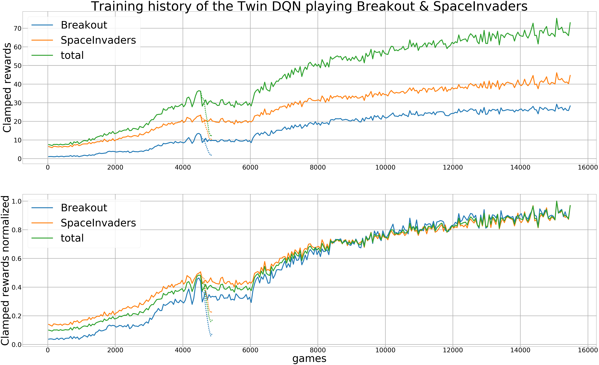

# Twin DQN - Two tasks, one net

This implemention contains the work for the DL4CV project WS17/18 at TUM.

Our goal was to train an agent, that is capable to play two games at once, with the same inputs.
You can imagine this as playing two games with one controller and trying to be as good as possible.

The content of the subdirectory is:
- FailedArchitcture: An architecture, that did not work
- Notebooks: Jupyter Notebooks to evaluate the training and generate plots
- Poster: The final poster for the presentation
- ProjectProposal: our project ProjectProposal
- Results: Data of the training, the evaluation and the evaluation of random agents
- TrainedModels: models, that can be used to train the model further or to play

## Requirements
- Python 3.5+

All requiremnts installed:

    $ pip3 install -r requirements.txt

## Usage
There is an extensive help provided inside the agents.

To train or play a single game use:

    $ python single_agent.py [--help]
    
To train or play two games at once use:

    $ python double_agent.py [--help]
    

## Results

Result of training the games Breakout & SpaceInvaders for 15000 games

Training history

## References
- [PyTorch Reinforcement Learning Tutorial](http://pytorch.org/tutorials/intermediate/reinforcement_q_learning.html)
- [Mnih et al. 2015, Human-level control through deep reinforcement learning](https://deepmind.com/research/dqn/)
